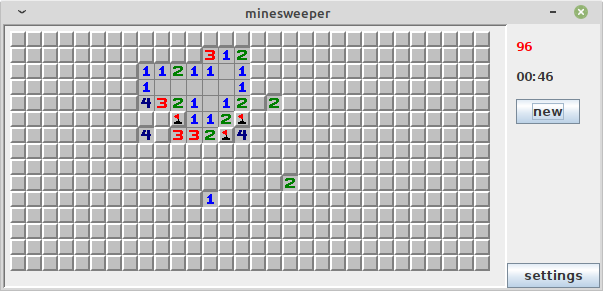
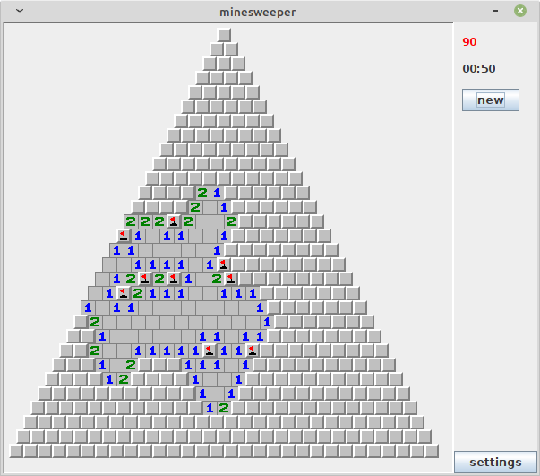
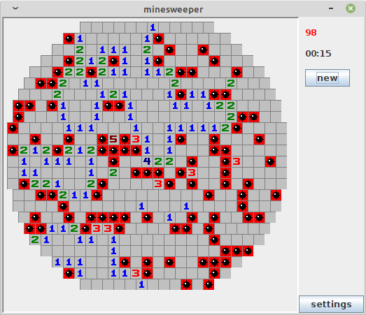

# Minesweeper

A simple minesweeper with an ablility to switch the shape of the playing field between
a rectangle, a circle and a triangle.

## Usage
clone the repo
   ```sh
   git clone https://github.com/kadsa/minesweeper.git
   ```
cd inside the repo

compile
 ```sh
   javac @toCompile
   ```
run
 ```sh
   java Minesweeper
   ```

## Examples


